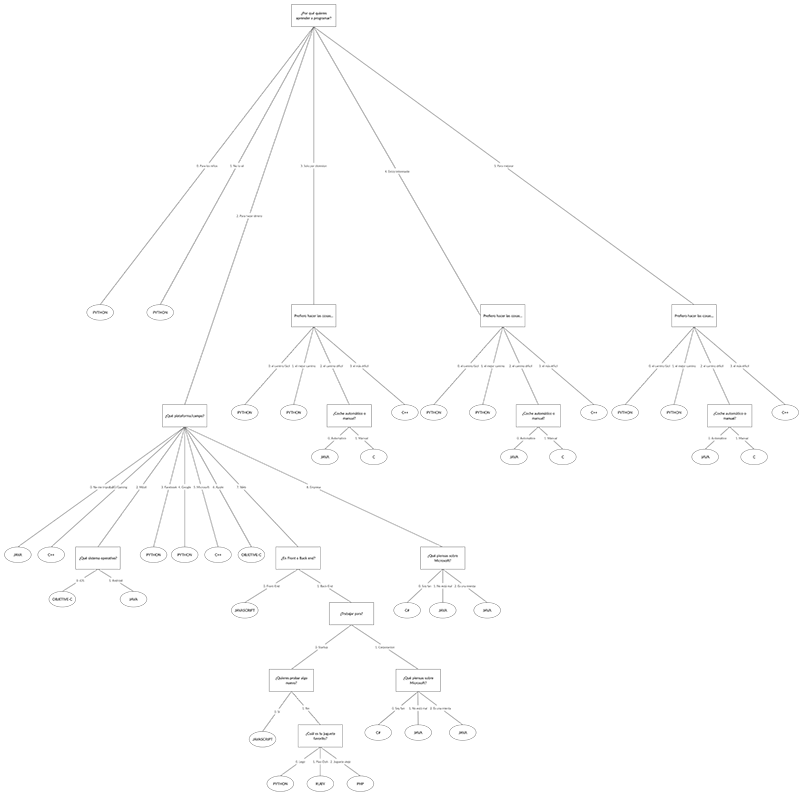

    

#   Trabajo Práctico de Representación del Conocimiento
:school: Universidad de Huelva  
:books: Curso 2019-2020    
   

##  Intención de la práctica
Con el desarrollo de esta práctica, pretendemos realizar un sistema experto implementado en el lenguaje declaratico
PROLOG, una vez creado el sistema y sea totalmente funcional, desarrollaremos una skill de Alexa, la cual hará de 
mediadora entre el usurio y nuestro sistema. Alexa leerá las opciones del sistema y reconocerá la voz del usuario 
que dirá con su voz dirá la opción que desee, alexa "dirá" internamente a prolog qué opción ha sido la seleccionada 
y la ejecutará para que nos devuelva otra salida.

Como sistma experto nos vamos a basar en un Github que hemos encontrado, pese a que contenia errores, nos hemos 
dispuesto a corregirlos, incluso pretendemos traducirlo, ya que apenas hemos encontrado información en español, 
aunque sabemos que es importante el uso de idimas, queriamos que exista información en español, para que quien quiera 
realizar una práctica similar, no tenga que dedicar tiempo en entender el idioma y pueda centrarse al completo en 
el desarrollo.

## Diseño del Sistema Experto en Prolog

Para la implementación del sistema experto, hicimos uso del lenguaje declarativo "Prolog", pese a que en la 
asignatura nos enseñan a programar en este lenguaje, tuvimos que buscar información por otros medios, ya que
los conocimientos que necesitamos iban un poco más allá del objetivo de la asignatura, teniamos entre manos
un proyecto en cierta medida ambicioso.

Nos hemos basado casi por completo en este repositorio(1). Es muy recomendable, ya que nos sirvió para aprender 
a como hacer un sistema experto en condiciones. En la página metalevel(2) pudimos hacernos una idea de qué camino 
tomar, por así decirlo existen 3 tipos de implementaciones y en función de lo que busquemos nos sirve más una u otra.
Realmente no nos decantamos por uno en concreto, si no que hicimos una especie de mezcla que una vez acabado, no
sabemos muy bien en qué categoría meter. Nos creamos una especie de árbol de decisión para tener más claro los
caminos que estábamos generando y también para facilitar la fase de testeo, en la que encontramos bastantes fallos
que nos habíamos dejado por el camino. 


    
Incluso hay que mencionar que conseguimos corregir un fallo que venía en el
repositorio en el que nos estábamos basando. Como queríamos aportar un pequeño toque de originalidad y diferencia,
decidimos traducirlo al español, que siempre es más cómodo para quien esté buscando información y no quiera perder
tiempo con los pequeños atrasos que pueda hacer el trabajar con una lengua extranjera.

## Implementación en Prolog
Para quien no esté familiarizado con este lenguaje de programación declarativo, vamos a explicar los pasos que hemos
seguido para realizar la implementación.

Primero necesitamos descargar su entorno, SWI-Prolog(10). Tiene una interfaz muy sencilla, donde podemos consultar
nuestro código, editarlo en el propio entorno, etc. Nosotros usamos un editor de código externo, ya que el que trae swi
deja que desear, usamos Visual Studio Code vinculado con este repositorio, lo cual recomendamos hacer, ya que es una
herramienta muy cómoda y muy bien integrada en el editor.

En cuanto a la programación, la forma de plantear los problemas es diferente a la de un lenguaje imperativo, como puede
ser Java, C++, etc. En este lenguaje no manejamos métodos, los llamamos predicados, para entender su funcionamiento
podemos basarnos en la lógica proposicional 

```
inicio :-
    introduccion,
    reset_respuestas,
    busca_lenguaje(Lenguaje),
    describe(Lenguaje), nl.
```

## Bibliografía
[1. GitHub Sistema Experto](https://github.com/linkyndy/expert-systems)  
[2. Metalevel Prolog](https://www.metalevel.at/prolog/expertsystems)  
[3. Cómo crear tu primera Skill en Alexa](https://www.youtube.com/watch?v=LAN-BJs6zrw)  
[4. Playing with Prolog](https://www.youtube.com/watch?v=ScrEe1vsPug&feature=emb_title)  
[5. GitHub Quiz](https://github.com/alexa/skill-sample-nodejs-quiz-game)  
[6. Llamar a Prolog desde PHP y tener un sistema experto en la web](https://www.youtube.com/watch?v=3sUj523cfPE)  
[7. GitHub Checkers Game Prolog y PHP](https://github.com/codermapuche/PHP-Prolog-HTML5-Checkers-Game)  
[8. Lista de reproducción cómo hacer una skill desde cero](https://www.youtube.com/watch?v=qv7ULb0TCN8&list=PL2KJmkHeYQTNzra-T2ayhV_84dHYCShAQ)  
[9. Prolog web FrameWork](https://www.youtube.com/watch?v=0fyE8Fuj3sg&list=PLo2Yjnxu38Q8VI6WVFLlTQOZ9LH9M4wyk)  
[10. Swi-Prolog](https://www.swi-prolog.org/)
