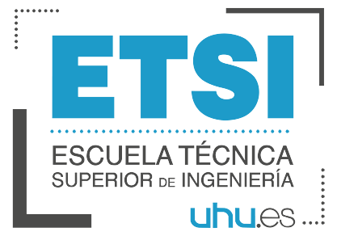

    

#   Trabajo Práctico de Representación del Conocimiento
    Universidad de Huelva
    Curso 2019-2020
    
    Desarrolladores:
    Carlos García Silva
    David Campero Maña
    
   

##  Intención de la práctica
    Con el desarrollo de esta práctica, pretendemos realizar un sistema experto implementado en el lenguaje declaratico
    PROLOG, una vez creado el sistema y sea totalmente funcional, desarrollaremos una skill de Alexa, la cual hará de 
    mediadora entre el usurio y nuestro sistema. Alexa leerá las opciones del sistema y reconocerá la voz del usuario 
    que dirá con su voz dirá la opción que desee, alexa "dirá" internamente a prolog qué opción ha sido la seleccionada 
    y la ejecutará para que nos devuelva otra salida.
    
    Como sistma experto nos vamos a basar en un Github que hemos encontrado, pese a que contenia errores, nos hemos 
    dispuesto a corregirlos, incluso pretendemos traducirlo, ya que apenas hemos encontrado información en español, 
    aunque sabemos que es importante el uso de idimas, queriamos que exista información en español, para que quien quiera 
    realizar una práctica similar, no tenga que dedicar tiempo en entender el idioma y pueda centrarse al completo en 
    el desarrollo.
